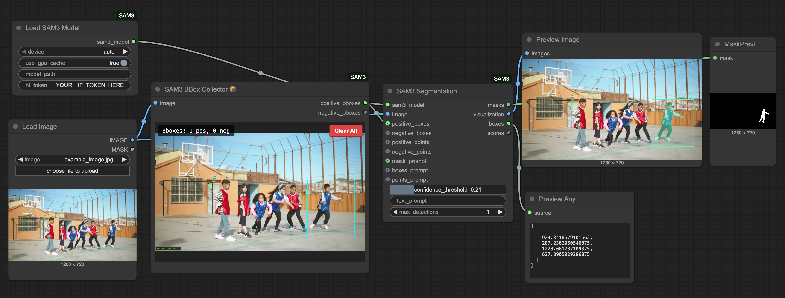
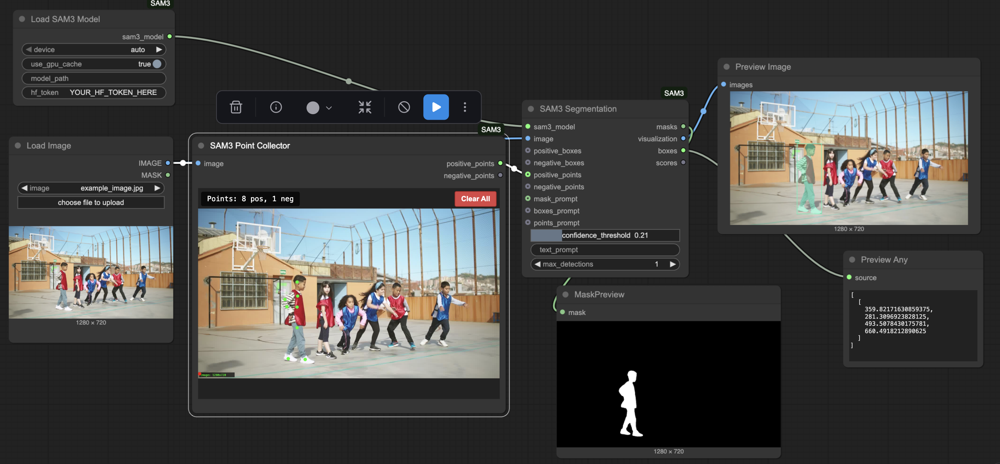
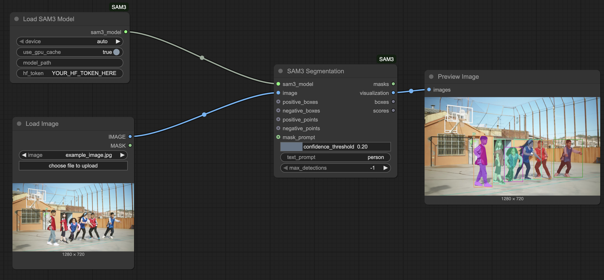
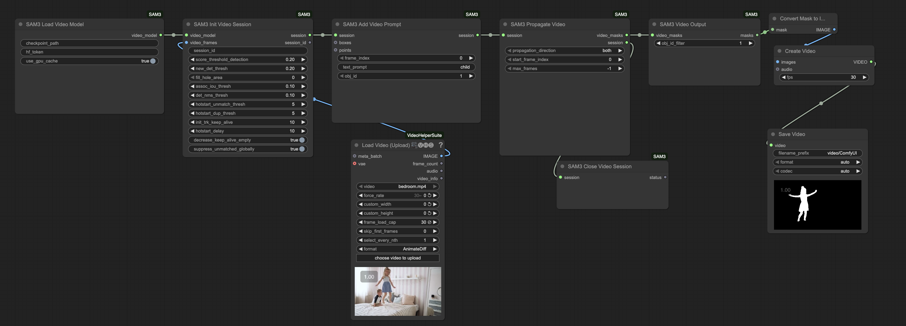

🚀 Key Features & UX ImprovementsNext-Level Canvas Integration: Solved the video frame canvas resizing issue by rendering the editor directly over the ComfyUI interface. It seamlessly mimics Comfy's native panning and zooming, ensuring the overlay stays perfectly locked to the node regardless of graph navigation.Instant Session Frame Loading: Implemented instant video frame loading directly upon connecting to a session node, completely eliminating the need to queue the prompt or execute the entire workflow just to get a preview. Multi-Frame Refinement Workflows: Enabled fluid chaining of multiple editor nodes within a single tracking session. This allows users to easily build a comprehensive "character map" by using sequential nodes to add refining prompts across different keyframes. Complete removal of `prompt_mode`: The redundant dropdown menu has been removed; there is no longer a need to switch the interface between points and boxes. Parallel processing (All-in-One): All prompt types (positive/negative points and blue/orange boxes) now operate simultaneously within a single frame. Direct text input: The `text_prompt` field has been moved to the node's main parameters, allowing you to combine a text description of a concept (e.g., "person," "car") with graphical prompts. Scalable image input: The connected reference image is displayed directly within the editor, and the logic automatically recalculates click coordinates to match the video session's resolution.


🚀 Ключевые изменения и улучшения интерфейса (UX)Идеальная интеграция с холстом ComfyUI: Полностью решена проблема со сбросом размеров и масштаба картинки из видео. Теперь редактор отрисовывается поверх интерфейса ComfyUI, идеально имитируя родное перемещение и зум графа. Оверлей больше не "слетает" при навигации.Мгновенная загрузка кадров без запуска генерации: Реализована автоматическая загрузка нужного кадра из видео сразу при подключении ноды к сессии. Больше не нужно выполнять воркфлоу (Queue Prompt) только ради того, чтобы увидеть картинку в редакторе. Многокадровая уточняющая сегментация: Добавлена полноценная поддержка цепочек из нескольких нод редактора, объединенных одной сессией. Это позволяет создавать сквозную «карту персонажа», уточняя маску на разных ключевых кадрах видео с помощью последовательных нод перед финальным трекингом. Полное удаление prompt_mode: Убран лишний выпадающий список (мод). Больше нет необходимости переключать интерфейс между точками и боксами.Параллельная обработка (All-in-One): Все типы подсказок (позитивные/негативные точки и синие/оранжевые боксы) теперь работают одновременно в рамках одного кадра.Прямой ввод текста: Текстовое поле text_prompt вынесено в основные параметры ноды, позволяя совмещать текстовое описание концепта (person, car и т.д.) с графическими промптами.Масштабируемый вход image: Подключенный референс отображается прямо внутри редактора, а логика автоматически пересчитывает координаты кликов под разрешение видео-сессии.

# ComfyUI-SAM3

ComfyUI integration for Meta's SAM3 (Segment Anything Model 3) - enabling open-vocabulary image and video segmentation using natural language text prompts.


https://github.com/user-attachments/assets/323df482-1f05-4c69-8681-9bfb4073f766

## Installation

Install via ComfyUI Manager or clone to `ComfyUI/custom_nodes/`:
```bash
cd ComfyUI/custom_nodes/
git clone https://github.com/PozzettiAndrea/ComfyUI-SAM3.git
cd ComfyUI-SAM3
python install.py
```

### Optional: GPU Acceleration for Video Tracking

For 5-10x faster video tracking, install GPU-accelerated CUDA extensions:
```bash
python speedup.py        # Auto-detects your GPU, ~3-5 min compilation
```

This is **optional** and only benefits video tracking performance. Image segmentation works fine without it. The script will:
- Auto-detect your GPU architecture and compile only for your specific GPU (75-80% faster than previous versions)
- Auto-install CUDA toolkit via conda/micromamba if needed
- Compile GPU-accelerated extensions (torch_generic_nms, cc_torch)

**Requirements:** NVIDIA GPU with compute capability 7.5+ (RTX 2000 series or newer), conda/micromamba environment recommended.

**RTX 50-series (Blackwell):** Experimental support available via `python speedup_blackwell.py` (~45-60 sec compilation). May compile successfully but runtime stability not guaranteed due to PyTorch lacking official sm_120 support. Falls back to CPU mode if compilation fails. Track PyTorch support at [pytorch/pytorch#159207](https://github.com/pytorch/pytorch/issues/159207).

## Troubleshooting

### SAM3 nodes not appearing in ComfyUI

If SAM3 doesn't load and you see "running in pytest mode - skipping initialization" in the logs, this is a false positive detection.

**Solution:** Set the environment variable before starting ComfyUI:
```bash
# Linux/Mac
export SAM3_FORCE_INIT=1

# Windows
set SAM3_FORCE_INIT=1
```

This forces SAM3 to initialize even if pytest is detected in your environment.

### Examples









## Nodes

### Image Segmentation
- **LoadSAM3Model** - Load SAM3 model for image segmentation
- **SAM3Segmentation** - Segment objects using text prompts ("person", "cat in red", etc.)
- **SAM3CreateBox** - Create bounding box prompts (normalized coordinates)
- **SAM3CreatePoint** - Create point prompts with positive/negative labels
- **SAM3CombineBoxes** - Combine multiple box prompts
- **SAM3CombinePoints** - Combine multiple point prompts

### Video Tracking
- **SAM3VideoModelLoader** - Load SAM3 model for video tracking
- **SAM3InitVideoSession** - Initialize video tracking session
- **SAM3InitVideoSessionAdvanced** - Advanced session initialization with custom settings
- **SAM3AddVideoPrompt** - Add object prompts to track in video
- **SAM3PropagateVideo** - Propagate object tracking through video frames

### Interactive Tools
- **SAM3PointCollector** - Interactive UI for collecting point prompts
- **SAM3BBoxCollector** - Interactive UI for drawing bounding boxes

---

## Quick Start

1. Add **LoadSAM3Model** node (first run downloads ~3.2GB model from HuggingFace)
2. Add **SAM3Segmentation** node, connect model
3. Enter text prompt: `"person"`, `"cat in red"`, `"car on the left"`
4. Get masks, visualization, boxes, and confidence scores

**Text Prompt Examples:**
- `"shoe"`, `"cat"`, `"person"` - Single objects
- `"person in red"`, `"black car"` - With attributes
- `"person on the left"`, `"car in background"` - Spatial relations

**Video Tracking:**
1. Use **SAM3VideoModelLoader** instead of LoadSAM3Model
2. Initialize session with **SAM3InitVideoSession**
3. Add prompts with **SAM3AddVideoPrompt**
4. Propagate with **SAM3PropagateVideo**

## Credits

- **SAM3**: Meta AI Research (https://github.com/facebookresearch/sam3)
- **ComfyUI Integration**: ComfyUI-SAM3
- **Interactive Points Editor**: Adapted from [ComfyUI-KJNodes](https://github.com/kijai/ComfyUI-KJNodes) by kijai (Apache 2.0 License). The SAM3PointsEditor node is based on the PointsEditor implementation from KJNodes, simplified for SAM3-specific point-based segmentation.
